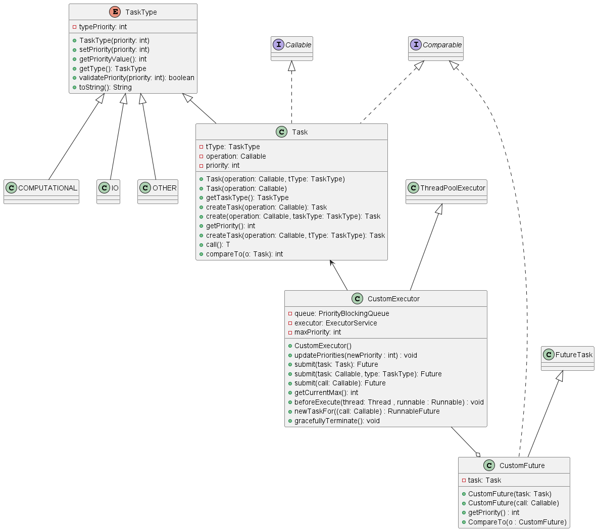

## Part 2
In this class we had to create 3 new classes.
We were given the TaskType class (enum) which makes sure the priorities are set correctly as well as creates 3 main priority types (COMPUTATIONAL, IO and OTHER).

"Java enables developers to set the priority of a thread, but not the Runnable operation it executes.
Tightly coupling the operation with the execution path that runs it creates major drawback when
using an executor such as a ThreadPoolExecutor: the collection of threads in an executor is defined by
a ThreadFactory. By default, it creates all threads with the same priority and non-daemon status." 
The aim of this project is to create two new classes so we can control the priorities of different tasks created.

### Task
The "Task" class is a class that implements the Callable interface as well as Comparable (since we need to compare tasks by their priorities).
The class implements Callable<T> because we were told that it should return something therefore the only possible option is Callable as Runnable returns void.
We've created 2 different constructors and chose them to be protected since we also created Factor for Task so it's easier and safer to use. We chose constructors to be protected and not private as they're also used in the CostumerExecutor class.

Note that we our constructors are protected since we created Factory which is public and safe for users to use, we made the constructors protected and not private so we can use those constructors in the "CustomExecuter" class.

### CustomExecuter
The next class we had to implement is the CustomExecuter class. This class implements an Executor that can asynchronously compute Task instances. 
Users are able to submit a Task instance, or an operation that may return a value (using Callable) and will be used to create a Task instance. 
Users are also able to submit an operation that may return a value and a TaskType, which will also be used to create a Task instance.
In order to implement this class we chose to make it so it extends ThreadPoolExecutor as it is fairly similar however we had to take care of the priorities.
We created a function that updates an array with all possible priorities (1 through 10) and everytime a new task is created it increases the count in the correct cell.
We can return our max priority (which is the smallest one as said in class) by going through the array and returning the first cell which isn't 0. Since we only have at most 10 cells to go over the running time would be O(1).

### CustomFuture
Another important class we had to create is this class which implements both FutureTask and Comparable.
This class is used as a wrapper for the task that can hold additional information and methods, here it is used to hold the priority of the task that is going to be executed later on in the thread pool, also by implementing compareTo method we are able to order the task in the priority queue.
Additionally, there is a getPriority() method that returns the priority of the task that this future represents.

## UML diagram

